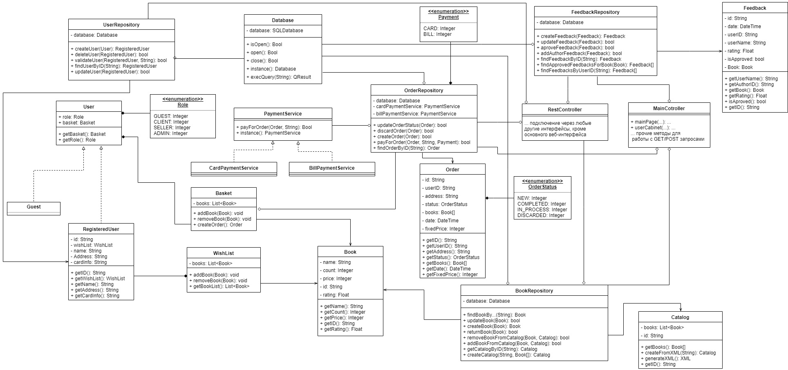

Вся работа с web-интерфейсом осуществляется через MainController, используя Spring. Прочие интерфейсы могу использовать функционал интернет-магазина через REST API. Оба контроллера используют паттерн Repository для предоставления функционала.

Определение функционала доступного для пользователя определяется с помощью Spring Security и распределением ролей. Для этого после доступа к аккаунту генерируются отдельные страницы в зависимости от роли. 

