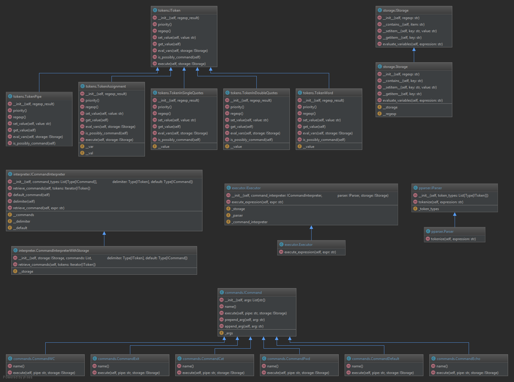

Интерпретатор командной строки, поддерживающий следующие команды:
* cat [FILE] — вывести на экран содержимое файла;
* echo — вывести на экран свой аргумент (или аргументы);
* wc [FILE] — вывести количество строк, слов и байт в файле;
* pwd — распечатать текущую директорию;
* exit — выйти из интерпретатора.

Архитектура:

Класс IToken - представляет собой интерфейс для токены, поиск которых будет осуществляться в исходном выражении, от него наследуются TokenInSingleQuotes, TokenInDoubleQuotes, TokenPipe,
TokenAssignment, TokenWord, которые отвечают токенам в соответствии со своим названием.

В последствии список классов токенов, которые необходимо распарсить передаются в класс, наследованный от интерфейса IParser,
который в свою очередь должен преобразовать входную строчку в набор токенов

Класс IStorage представляет собой интерфейс для представления хранилища для переменных окружения,
его метод evaluate_variables, должен принимать строку и заменять вхождения всех переменных на их значения,
переменные ищутся по регулярному выражению, переданному в конструктор

Команды и интерфейс ICommand представляют собой логику работы отдельной команды, из ключевых методов - 
name, который должен вернуть имя команды, по которому будет выполнена подстановка и execute логика самой команды. Команды
реализованы согласно списку в начале файла.

Интерпретатор ICommandInterpreter должен реализовывать преобразование потока токенов в поток команд с помощью 
метода retrieve_commands, также при его создании необходимо указать разделитель команд (в нашем случае TokenPipe), а также
команду, которая будет выбрана по умолчанию, если все остальные команды не подошли

IExecutor - аккумулирует все вышеперечисленное и должен преобразовывать входное выражение в результат его исполнения, что делает его 
единственный метод execute_expression

